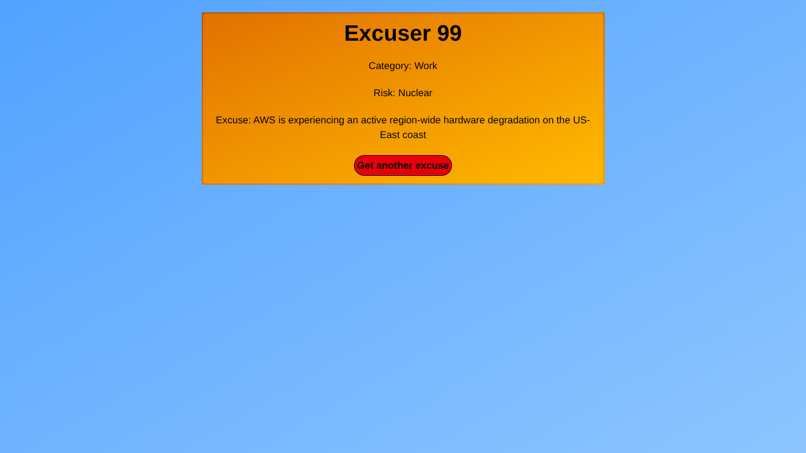
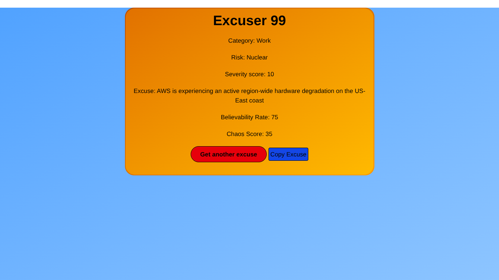
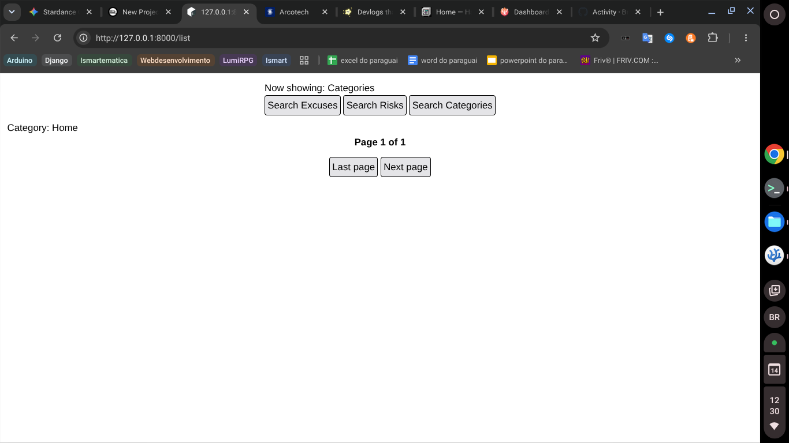
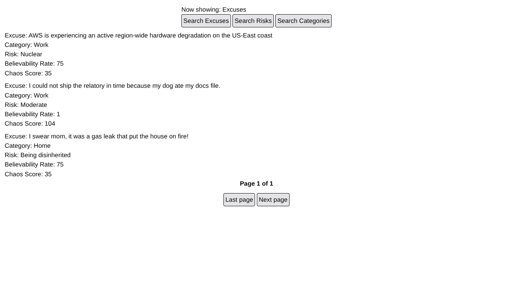
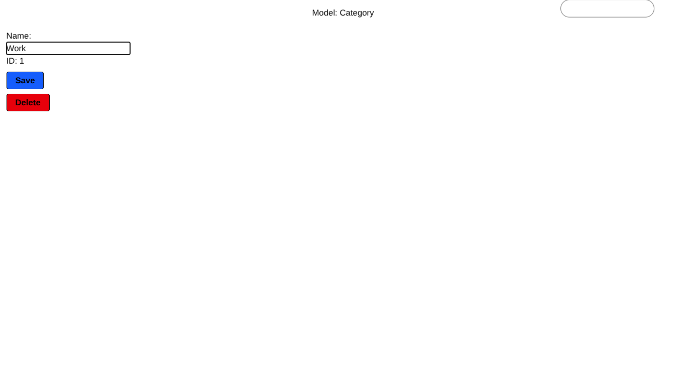
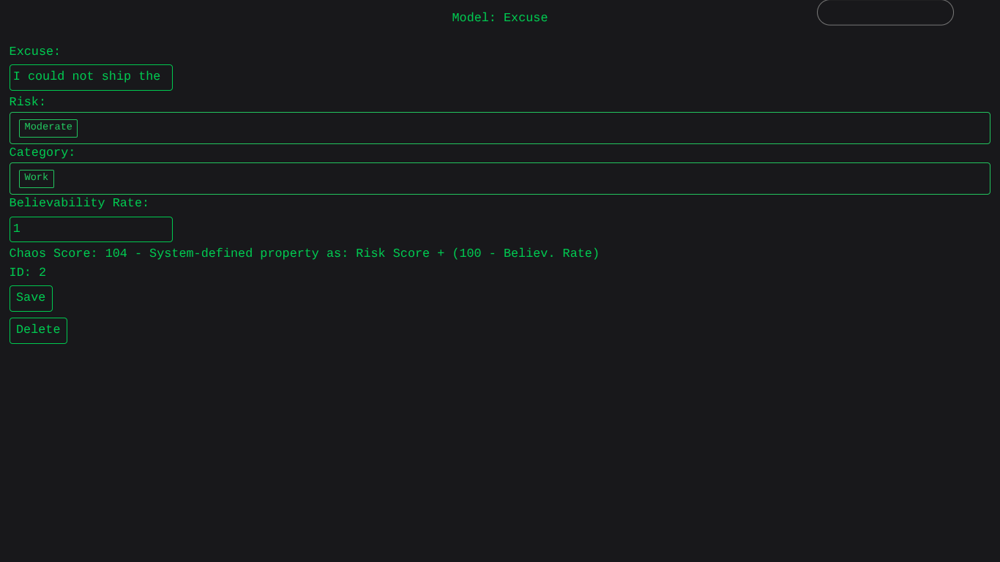
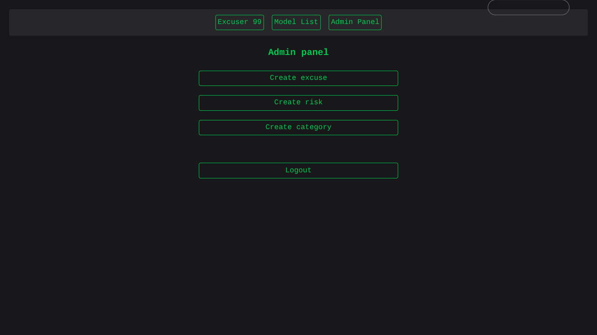
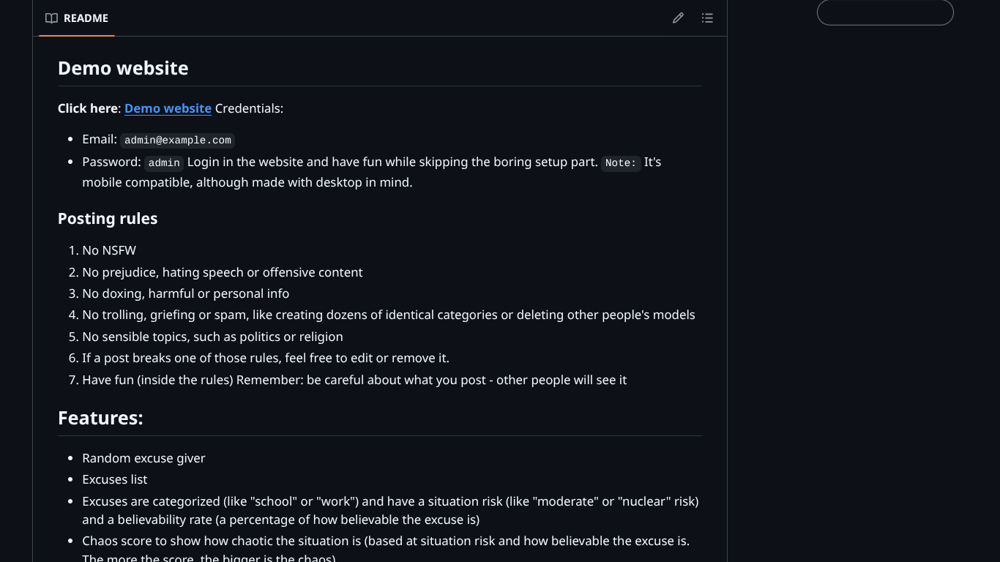

# Devlog Entry

## Project Context & Progression
I started brainstorming and prototyping the initial core engine of this project shortly before discovering Stardance and creating the GitHub repository. At that stage, the project was completely raw and missing the vast majority of its current features. 

Approximately **50% to 70% of the entire project** - Including the terminal style, the finished CRUD operations, TomSelect integrations, mobile optimization, and overall production polishment - was built entirely from scratch during my hours logged for Stardance.

## Progress Timeline

### The absolute beginning (Thursday, June 4 - Wednesday, June 10): 
I didn't know about Stardance, didn't have a devlog and didn't have a GitHub repository, but I already had:
1. Idea - A humorous website to generate silly excuse.
2. Tools - Chose to use Laravel, Tailwind CSS and SQLite to turn my idea into a real thing. TomSelect came later as a necessity during the development.
3. Beginning of development - Creation of the models, of the index page and the first routes.
4. Struggles - like Vite not running

**Landing Page from Saturday, June 6**

### Wednesday, June 10: 
* **The "Starting" Line:** I both joined Stardance and uploaded my files into GitHub.

**Raw Landing Page**

**Broken List Page**

### Thursday, June 11: 
* **Fixed List Page:** Before this fix, the page would only show the last model in id. With that, it shows all models.
* **Model Editing Page:**. The hardest part was to deal with the dropdowns. That's when TomSelect came in scene. Even then, I struggled with TomSelect at first.

**Fixed List Page**

**Model Editing page**

### Friday, June 12: 
* **Edit Route:** I ended the edit route and made it all work. 
* **Terminal Style:** I struggled to make the website look beautiful. It looked really bad, even with Tailwind CSS. That's when I chose to make terminal style: sleek, cool and simple. It ended up being way prettier than the gradients I first tried.

**Terminal-Style Excuse Editing Page**

### Saturday, June 13: 
A really productive day.
* **Finished CRUD:** I ended the admin panel (the page where you can create new instances of models) and the delete route.
* **Navbar:** Now navigation is way more fluid
* **Mobile Support:** With mobile support, I mean it's usable and stable in mobile, not that it'll looks as cool or be as easy to use as it's in PC. 
* **Debugging:** Small issues, such as a wrong variable name in `app/Models/Risk.php`. Those kind of issues are small just in size (like a single character or a wrong word), but they're huge in impact, like breaking a whole route, page or function. This was exactly the case of this one: it'd ruin the creating and editing routes of risk models.
* **TomSelect:** Made it a local library, instead of the CDN it was, to make the app load faster and be more self-contained.
* **Small Improvements** such as adding some Tailwind CSS classes to some tags.
* **Documentation:** The last improvement was in README, to fit more in Stardance requirements, and in DEVLOG (this file!).

**Finished Admin Panel**

### Sunday, June 14: 
* **Documentation:** README and DEVLOG. I made README more detailed and added the landing page screenshot to it. 
* **Commiting:** I pushed some commits from Saturday that were missing.
* **Favicons:** I added the Bash logo favicons to the project.
* **Deploying:** As I write this devlog section, I'm trying to deploy this project to create the demo

**README in Hello-Laravel GitHub page**

## GitHub History

* -> The upload of this updated DEVLOG (Won't be logged here because to log it here, I'd have to update the DEVLOG, which would create a new commit, which I'd have to log here...)

* `941b1ec` (HEAD -> main) Updated PHP requirement to 8.4
* `7a3ecc5` (origin/main) Improved DEVLOG.md, specially by adding screenshots
* `51c3a5f` Small tweak in DEVLOG (commiting only to be able to do checkout)
* `be8ed5a` Improved DEVLOG
* `391d482` Moved markdown assets into new assets folder
* `d232336` Created devlog
* `389bf18` Improved README.md to fit the Stardance README standard
* `8403d85` Added hero image to be used in README.md
* `4b87821` Added favicons (bash logo)
* `4fe3919` Added seeder for user to make creating admin account easier
* `1f94518` Moved tomSelect scripts out of blade files to organize the code
* `fcc1543` Made tomSelect a local package to make the app more self contained
* `ad911da` Updated README
* `0397bcd` Added title to website
* `a5a7632` Added csrf token to logout button
* `3fb766f` Added navbar, admin panel and mobile support
* `276f3a6` Added terminal style and edit route
* `cc5068c` Added admin category editing option
* `2cc4618` (origin/master) Pushing the already existing files