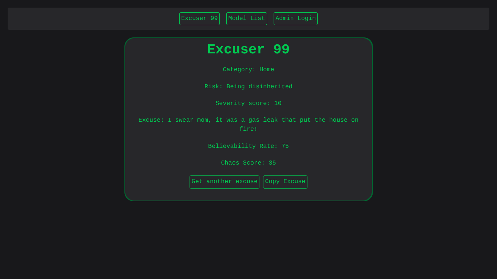

# Hello-laravel
A humorous-intended website about giving excuses to diverse situations, such as accidentally deleting your company's whole database or not doing your virtual homework because 'your dog ate your computer'.

## Preview
**Landing page**


## Demo website
**Click here**:
**[Demo website](https://brzueira.hackclub.app/)**
Credentials:
* Email: `admin@example.com` 
* Password: `admin`

Login in the website and have fun while skipping the boring setup part.
**Note:** It's mobile compatible, although made with desktop in mind.

### Posting rules
1. No NSFW
2. No prejudice, hating speech or offensive content
3. No doxing, harmful or personal info
4. No trolling, griefing or spam, like creating dozens of identical categories or deleting other people's models
5. No sensitive topics, such as politics or religion
6. If a post breaks one of those rules, feel free to edit or remove it.
7. Have fun (inside the rules)
Remember: be careful about what you post - other people will see it

## Features:
* Random excuse giver
* Excuses list
* Excuses are categorized (like "school" or "work") and have a situation risk (like "moderate" or "nuclear" risk) and a believability rate (a percentage of how believable the excuse is)
* Chaos score to show how chaotic the situation is (based at situation risk and how believable the excuse is. The more the score, the bigger is the chaos)
* If you have an account, you can create, edit and remove excuses, categories and risk tags

## Technical Choices & Tools
* **SQLite:** Chosen for simple, 100% free, local and zero-configuration setup, making local onboarding and database migration instant for reviewers.
* **Custom Calculations:** The Chaos Score equation runs fully server-side via Laravel controllers before parsing to the view, keeping the mathematical logic secure and centralized.
* **TomSelect:** Chosen because it's a simple way to make the excuse dropdowns that involved the risk and category models.
* **Terminal Style:** Chosen because it's simple to make, yet the result can be awesome.
* **Tailwind CSS:** Chosen because it's a modern, industry-standard framework to stylize pages in a simple and convenient way.
* **Laravel:** Chosen both because it's a batteries-included and simple to use framework and because I simply wanted to learn a new, industry-standard web framework.

## License
It's under MIT license, so do whatever you want to it: Redistribute, edit, sell (good luck finding someone willing to pay for it), be inspired, actually using the excuses (and worsening whatever situation you're in), printing this README and eating the paper (please don't)... The sky is the limit, just don't say it was made by you. Also, if you manage to actually make money with this website, tell me , and I'll include your name here for your impressing feat. See the full LICENSE file for legal details.

## How to Run Locally
Requirements: PHP >= 8, Composer >= 2, Node.js >= 18, NPM >= 11, SQLite3 (setup scripts already install everything for you)

### Steps
1. Clone the repository and enter the directory: 
```bash 
git clone https://github.com/Br-Zueira/Hello-Laravel.git
cd Hello-Laravel
```

2. Run the setup script: 
```bash
./setup-dev.sh
```
- It will automatically create the credentials:
    * Email: `admin@example.com` 
    * Password: `admin`

    Alternatively, you can use `./setup.sh` for production setup. The difference is that it runs commands without sudo (assumes session is logged as root, which is case for Nest, the platform I used to host the preview website), uses cache flags to speed up website, ignore dev dependencies and starts website as daemon, so `./setup.sh` lets you ignore the rest of the steps.

3. Initiate Vite: 
```bash
npm run dev
``` 
* Alternatively, you can use `npm run build` to compile it beforehand, although for development and testing it's preferable to use the runtime resource server.

4. Spin up the server: 
```bash
php artisan serve
```

5. Open [http://127.0.0.1:8000](http://127.0.0.1:8000) in your browser and start generating chaos.

## Credits & Acknowledgments
* **Lead Developer:** Myself.
* **The Open-Source Giants:** The creators and contributors behind **Laravel**, **Tailwind CSS**, **TomSelect**, **NPM**, **Composer**, and **SQLite3**. I don't know exactly who all of them are, and they definitely don't know they just helped me build a chaotic excuse generator, but their work heavily carried this project on its back.
* **Nest:** Let me host the web preview 100% for free and way more intuitively than other platforms, so you're able of generating chaos without setupping anything!

## Note
As you can see, this project was made to have fun and to learn, and is totally memey and unhinged. I hope you have fun with this project just like I had doing it!
